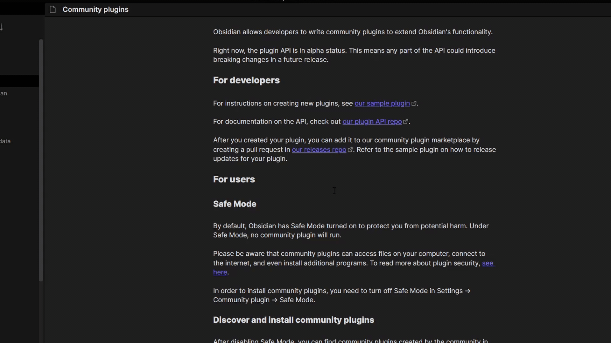

## Doubleshift

press `SHIFT` twice to activate Doubleshift.\
\
By default it opens the command palette but you can set it to a different command. For example split vertically.\
\
It **works with every available command** including commands from other plugins. So if you have a plugin like the better command palette plugin installed you can choose the command to open it in the Doubleshift settings tab.

If you want to contribute to this plugin feel free to create a pull request at https://github.com/Qwyntex/doubleshift

